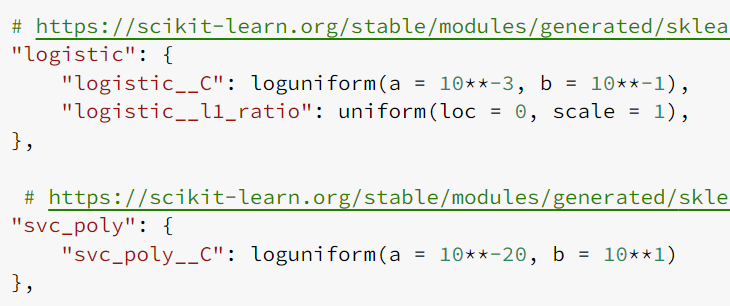
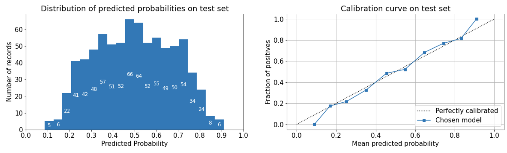
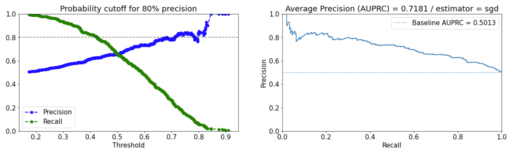
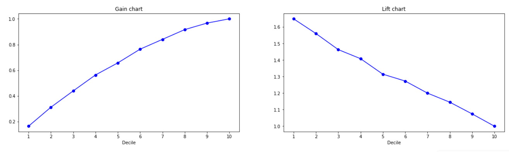
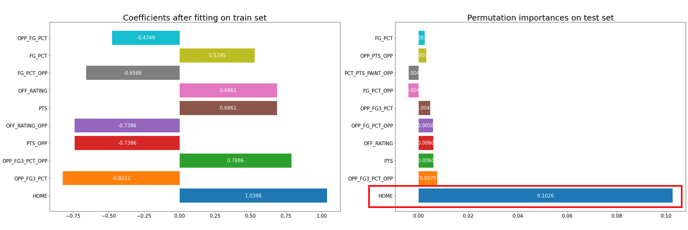
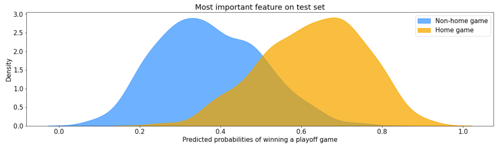

Notebooks to run:
- 1_playoff_games_load_data.ipynb

# Step 1: Load data 

1. Grab player and team stats using [Github NBA API](https://github.com/swar/nba_api) from NBA.com/stats 

2. Remove outlier seasons with games played (GP) <= 30 games or >= 60 games as we want the cutoff at around mid-season 

3. Fix the datatypes to numeric / category / string such that we can drop them in sklearn pipeline

4. Split dataset into train and test set by unique GAME_ID before any more EDA to prevent data leakage

# Step 2: ML workflow on train set

1. Exploratory data analysis 
   - No class imbalance: 1 row for win and 1 row for loss per playoff game
2. Data preparation pipeline
- 
- feature scaling = MinMaxScaler
- feature engineering = SeasonSimilarity
  - kmeans clustering to represent different NBA eras
  - silhouette score for optimal # of clusters 
- feature selection = L1 penalty with logisitc regression
  - to reduce training time
  - threshold = hyperparameter to tune
  - 
1. Shortlist promising models
   - Quickly check performance of various models using 10-fold cross validation
   - 
2. Hyperparameter tuning with RandomizedSearchCV
   - Tune top 5 models
   - Specify distribution of each hyperparameter (discrete uniform / continuous uniform / loguniform) 
   - Use 10-fold cross validation and 100 iterations to search for best hyperparameters optimizing for Average Precision 
3. Comparing performance on train set
   - Average precision with similar AUROC results 
   - Precision-Recall curve 

# Step 3: Evaluation on test set
Best model = SGD(log loss) with elastic net regularization 

## Predicted Probabilities
The model was able to generalize across a range of predicted probabilities

## Precision-Recall Curve
PR curve is much smoother now because of the larger train and test set with each row representing a playoff game instead of a team

## Average Precision (Area under PR Curve)
AP is better on test set vs 10-fold CV on train set but still within 1 SD of the CV results

## ROC Curve
Performance in AUROC is similar to AP

## Lift and gain chart
Lift is the best in 1st decile and by focusing on first 4 deciles, we can capture 56% of the champions

## Model inference
### Permutation importance
- While coefficients of our model are derived from training set, permutation importance is derived from test set
- This allows us to pinpoint the feature(s) that are most important in out-of-sample predictions
- On the left bar chart, a list of most important features sorted by the magnitude of coefficients in predicting the probability of winning a playoff game include home court advantage with various offensive and defensive stats
- On the right bar chart, permutation importance suggests for out-of-sample prediction, only the home court advantage matters

### Common features picked up by top models
- Instead of just looking at our best model, we can look at the top 5 models and see what features are common across them
- HOME: home court advantage
- BLKA: blocks attempted
- FG_PCT: field goal percentage
- PF: personal fouls committed
- OPP_AST: opponent assists
- OPP_FG_PCT: opponent field goal percentage

### Coefficients of best model
- To interpret with caution (signs could change with different hyperparameters)

- Before any manipulation, the data set contains 194 features
- After feature selection and other data cleaning procedures, there are 38 features remaining
- Finally, after fitting the best model with regularization, we can see that
  - significant variables: 
    - HOME
      - home court advantage helps teams win in playoffs
    - Transferrable skills from regular season to playoffs
      - OPP_FG3_PCT: you have a higher chance to win this playoff game when you can defend 3-pointers well in the regular season
      - 3 out of top 5 features are related to what your opponent is doing
        - OPP_FG3_PCT_OPP: you have a higher chance to win this playoff game when your opponent does a poor job defending 3-pointers in the regular season
        - PTS_OPP: you have a lower chance to win this playoff game when your opponent scores a lot in the regular season
        - OFF_RATING_OPP: you have a lower chance to win this playoff game when your opponent has a high offensive rating in the regular season

## How well does the prediction of playoff game outcome translate to predicting the ranking in playoffs (e.g. winning the champion)?
- Overall the prediction of playoff ranking is full of noise
- Precision never reaches above 80% when we try to predict the champion 
- Precision still never reaches above 80% when we try to predict the top 4 teams 
- Precision finally reaches above 80% when we try to predict the top 8 teams 
- Threshold of predicting playoff game outcome
  - Counter-intuitive
  - When threshold is lower, we can achieve a higher precision because we make more predictions of teams winning a game. Therefore there is more variability in the predicted ranking
  - When threshold is higher, we only predict a few games to be a sure win. Therefore we cannot differentiate between teams, leading to a lower precision in predicting the ranking

## Teams with greatest regret of not winning the playoff game
- Caution of reading probability without careful calibration on test set
- By sorting teams by predicted probabilities of winning a playoff game as confidence scores, we can tell which playoff game should have been won 
- 
- Honorable mentions include 
  - 2015-16 Warriors vs Cavaliers finals
  - 72-win season for Warriors
  - Game 5 when Warriors were up 3-1
  - Game 7 when Warriors were at home and the series is tied 3-3

# Limitation with modifying the business problem
  - Good AP and AUROC score in train and test set do not translate to good precision in predicting the ranking in playoffs
  - The model is not optimized for predicting the ranking in playoffs
